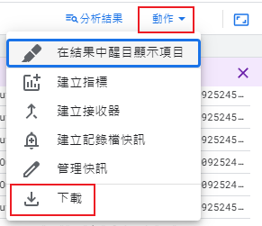

# GoogleCloud.Error.Analysis
Google Cloud 報錯紀錄 Json 格式檔案分析  

# 說明
為了整理特定錯誤的資料，  
首先必須從 Google Cloud 上查找你要整理的錯誤資料。  
  
接著下載 Google Cloud 上的錯誤資料到本地端。  
  
點選右下角的【動作】選單並點擊【下載】按鈕。  
  
選擇【JSON】格式並下載檔案。  

# 新增資料到 Redis
把下載下來的檔案資料以 VSCode 打開，  
並全選所有內容複製到 Redis 上，  
Redis Key 為 `downloaded-logs-20241027-111115`，  
並貼上 Redis 上且記得調整格式為 `Json`，  
並按下【儲存】按鈕。  
  

# 執行
上述完成設定後，  
開啟專案並執行，  
就能看到整理出來的內容。  
  
